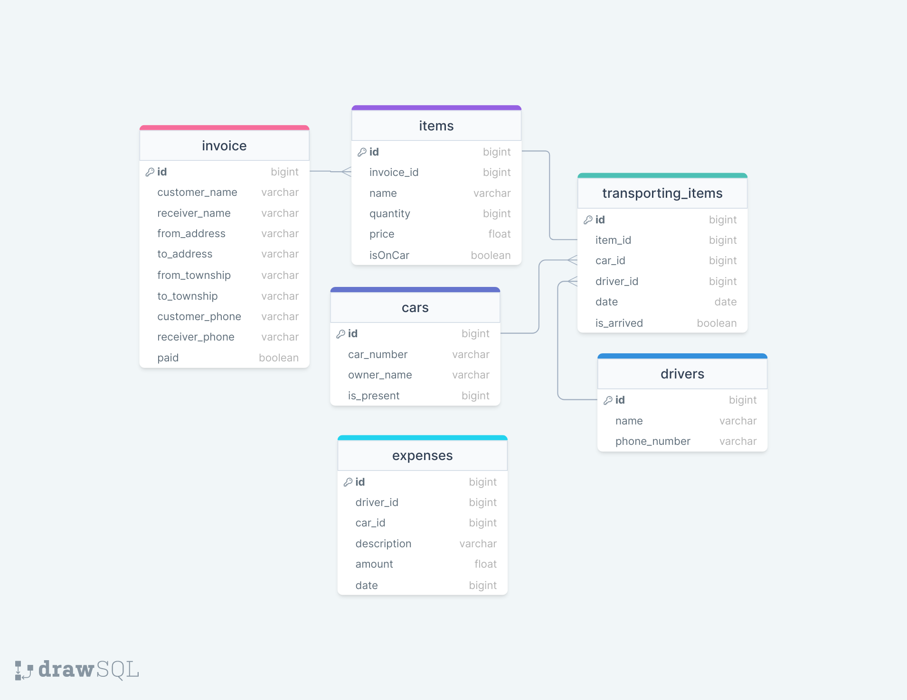

# Cargo Packaging

## About

- For cargo packaging at car gates
- create invoice for customers
- manage cars and drivers
- track the conditions of items (cargo)
- typeahead form field
- form validation
- search invoice (not paid)
- save the expenses
- correct burmese font problem in bluetooth print
- TODO -> test the printer 
- This is my first project and need to refactor a little bit and may be needed to write clean architecture

## Database Design

## Demo

(https://player.vimeo.com/video/867694846?h=5e9b620cc0)
